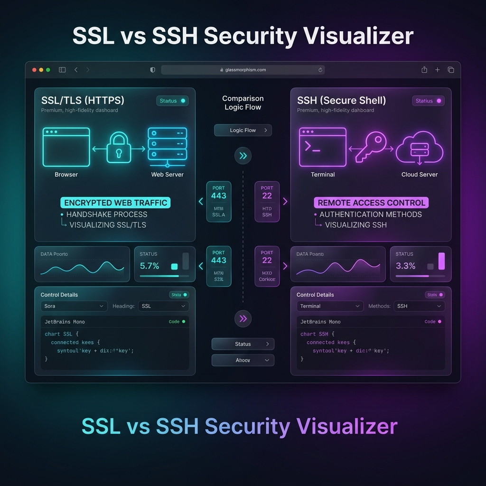

# 🔒 SSL vs 🔑 SSH Security Visualizer

<div align="center">




</div>

## 📋 Overview

The **SSL vs SSH Security Visualizer** is a high-fidelity, interactive educational tool designed to demystify fundamental web security concepts. Specifically tailored for developers, it explains the critical differences between **SSL/TLS (HTTPS)** and **SSH (Remote Access)** using real-time packet animations, relatable analogies, and practical code examples in **Spring Boot** and **React**.

### ✨ Highlights

- 🇱🇰 **Native Support** - Comprehensive explanations in **Sinhala** for better conceptual clarity.
- 🛡️ **SSL / TLS Deep Dive** - Visual simulation of Plain HTTP vs HTTPS encrypted data flow.
- 🚇 **SSH Tunneling** - Interactive breakdown of secure remote server control and key-based authentication.
- ⚖️ **Direct Comparison** - Side-by-side protocol analysis (Port 443 vs 22, SSL Certs vs SSH Keys).
- 💻 **Real-world Code** - Production-ready snippets for Spring Boot security properties and React HTTPS API calls.
- 🎨 **Premium UI/UX** - Sleek dark theme with glassmorphism panels and responsive layout.

</br>

## 🚀 Quick Start

### Prerequisites

- 🌐 **Modern Web Browser** (Chrome, Firefox, Safari, or Edge)
- 💾 **No dependencies** (Standalone HTML/CSS/JS)

### 📥 Installation

1. **Clone the repository:**
   ```bash
   git clone https://github.com/yasith-1/SSL-SSH.git
   cd SSL-SSH
   ```

2. **Open the Guide:**
   Simply open `index.html` in your preferred web browser.

---

## 🛠️ Technology Stack

<div align="center">

| Technology | Purpose | Version |
|------------|---------|---------|
|  | Structure | HTML5 |
|  | Design & Animation | Vanilla |
|  | Interaction Logic | ES6+ |
|  | Backend Example | 3.x |
|  | Frontend Example | v18+ |
|  | Typography | Sora / Noto Sans Sinhala |

</div>

---

## 🔄️ Scenarios Visualized

<div align="left">

<details>
<summary>🔒 1. SSL/TLS: Plain HTTP vs HTTPS</summary>
  
Shows how data like credit card numbers are exposed in plain text without SSL, and how they are encrypted into unreadable ciphertext when SSL/TLS is active.


</details>

<details>

<summary>🔑 2. SSH: Secure Remote Access</summary>

Demonstrates the creation of an encrypted tunnel between a local terminal and a cloud server (AWS/VPS) to run commands securely without password exposure.


</details>

<details>

<summary>⚖️ 3. Side-by-Side Comparison</summary>

A tabular breakdown of ports (443 vs 22), authentication methods (Certs vs Keys), and primary use cases (End-users vs Admins).


</details>

*Interactive dashboard for deep-diving into Web Security architectures*

</div>

---

## 📁 Project Structure

```
📦 SSL-SSH-Security/
├── 📁 css/                # Styling and animations
│   └── 📜 style.css       # Design system and glassmorphism
├── 📁 js/                 # Interaction logic
│   └── 📜 main.js         # Tab switching and UI scripts
├── 📁 screenshots/        # Visual documentation assets
│   └── 🖼️ dashboard.png   # Main visualizer interface
├── 📜 index.html          # Unified structure and guide content
└── 📜 README.md           # Documentation (You are here)
```

---

## 🎯 Core Functionalities

<div align="center">
   <table>
<tr>
<td width="50%">

### 🛡️ SSL / TLS Module
- 🔄 Plain vs HTTPS visual flow
- 💳 E-commerce code examples
- ⚙️ SSL Handshake explanation
- ✅ Common use cases (Banks, Login)
- 🔒 Let's Encrypt integration tips

</td>
<td width="50%">

### 🚇 SSH Module
- 🖥️ Local to Cloud tunnel concept
- 🔑 SSH Key Pair generation guide
- 🐳 Docker remote deploy commands
- 🐙 GitHub SSH setup instructions
- ⚙️ RSA/Ed25519 explanations

</td>
</tr>
<tr>
<td width="50%">

### ⚖️ Protocol Comparisons
- 🗂️ Detailed feature table
- 🚪 Port 443 vs Port 22
- 🚦 "When to use what" guide
- 🧬 Concept of Asymmetric Encryption
- 📊 Security Best Practices

</td>
<td width="50%">

### 🎨 Premium UI/UX
- 🌑 Sleek dark theme
- 🟣 Color-coded protocol accents
- ✨ Interactive tab panels
- 🎹 Space Mono / Sinhala typography
- 📱 Fully responsive design

</td>
</tr>
</table>
</div>

---

## 📞 Contact & Support

<div align="center">

### 👨‍💻 Developer : Yashith Prabhashwara

[](mailto:yasithprabaswara1@gmail.com)
[](https://www.linkedin.com/in/yashith-prabhashwara-a1aa471a6/)
[](https://github.com/yasith-1)

</div>

---

## 🙏 Acknowledgments

- Built to clarify fundamental web security for the Sri Lankan developer community.
- Inspired by the need for visual learning in cybersecurity.
- Focused on educational clarity with native language support.

---

<div align="center">

### 🌟 If you found this visualizer helpful, please give it a star! 🌟


**Made with ❤️ by [Yasith Prabaswara](https://github.com/yasith-1)**

</div>
